<div align="center">
  
</div>

<div align="center">
  
</div>

<div align="center">
  
  
</div>

---

<div align="center">
  
  
</div>

---

## 🚀 **Tech Arsenal**

<div align="center">
  
</div>

### **🛠️ Technologies & Tools**

<div align="center">
  
  
  
  
  
  
  
  
</div>

---

## 📊 **Activity Analytics**

<div align="center">
  
</div>

---

## 🏗️ **Architecture Evolution**

```mermaid
graph TB
    subgraph "🚀 Career Progression"
        A[Junior Dev] --> B[Mid-level]
        B --> C[Senior]
        C --> D[Architect]
        D --> E[Legend]
    end
  
    subgraph "🎯 Skills Growth"
        F[Learning] --> G[Building]
        G --> H[Optimizing]
        H --> I[Mastering]
    end
  
    subgraph "☕ Coffee Evolution"
        J[Basic] --> K[Intermediate]
        K --> L[Advanced]
        L --> M[Expert]
        M --> N[Master]
    end
  
    style A fill:#ff6b6b,stroke:#fff,stroke-width:2px
    style B fill:#4ecdc4,stroke:#fff,stroke-width:2px
    style C fill:#45b7d1,stroke:#fff,stroke-width:2px
    style D fill:#96ceb4,stroke:#fff,stroke-width:2px
    style E fill:#feca57,stroke:#fff,stroke-width:2px
    style F fill:#ff9ff3,stroke:#fff,stroke-width:2px
    style G fill:#54a0ff,stroke:#fff,stroke-width:2px
    style H fill:#5f27cd,stroke:#fff,stroke-width:2px
    style I fill:#00d2d3,stroke:#fff,stroke-width:2px
    style J fill:#8B4513,stroke:#fff,stroke-width:2px
    style K fill:#D2691E,stroke:#fff,stroke-width:2px
    style L fill:#CD853F,stroke:#fff,stroke-width:2px
    style M fill:#DEB887,stroke:#fff,stroke-width:2px
    style N fill:#F5DEB3,stroke:#fff,stroke-width:2px
```



---

## 🎯 **Current Mission**

<div align="center">
  <table>
    <tr>
      <td align="center" width="50%">
        
      </td>
      <td align="center" width="50%">
        
      </td>
    </tr>
  </table>
</div>

- **🎓 Learning**: Advanced Software Architecture & Design Patterns
- **⚡ Optimizing**: Everything I can get my hands on
- **🏗️ Building**: Scalable, maintainable systems
- **☕ Drinking**: Coffee (probably right now)

---

## 💡 **Philosophy**

<div align="center">
  
</div>

---

## 🎨 **What I Bring to the Table**

<div align="center">
  
</div>

- **🔧 Backend Excellence**: NestJS, TypeScript, PHP, Java
- **🎨 Frontend Skills**: Next.js, React ecosystem
- **🏗️ Architecture Mindset**: Always thinking about scalability and maintainability
- **⚡ Optimization Obsession**: If it's not optimal, it's not done
- **☕ Coffee Dependency**: Critical for system performance

---


---

## 📈 **Goals for 2024**

<div align="center">
  
</div>

- [ ] Master advanced software architecture patterns
- [ ] Contribute to open-source projects
- [ ] Optimize at least 3 major systems
- [ ] Reduce coffee consumption (just kidding, that's never happening)

---

## ☕ **Coffee Stats**

<div align="center">
  
</div>

```
Cups per day: 5-8 (depending on bug complexity)
Favorite: Black, strong, no sugar
Coding efficiency: Directly proportional to coffee intake
```

---

## 🏆 **GitHub Trophies**

<div align="center">
  
</div>

---

## 📊 **Weekly Development Breakdown**


## 🎯 **Skills Radar Chart**

```mermaid
radar
    title Skills Proficiency
    "NestJS" : 85
    "TypeScript" : 90
    "PHP" : 75
    "Java" : 70
    "Next.js" : 80
    "React" : 85
    "Docker" : 75
    "PostgreSQL" : 80
    "Architecture" : 65
    "Coffee Making" : 95
```

---

## 🤝 **Let's Connect**

<div align="center">
  <a href="https://linkedin.com/in/your-profile">
    
  </a>
  <a href="https://twitter.com/your-handle">
    
  </a>
  <a href="mailto:your.email@domain.com">
    
  </a>
  <a href="https://github.com/theboss001">
    
  </a>
</div>

---

## 🎯 **Fun Facts**

<div align="center">
  
</div>

## 🌟 **Achievement Timeline**


---

<div align="center">
  
</div>

---

<div align="center">
  
  
</div>

---

<div align="center">
  
  
</div>
